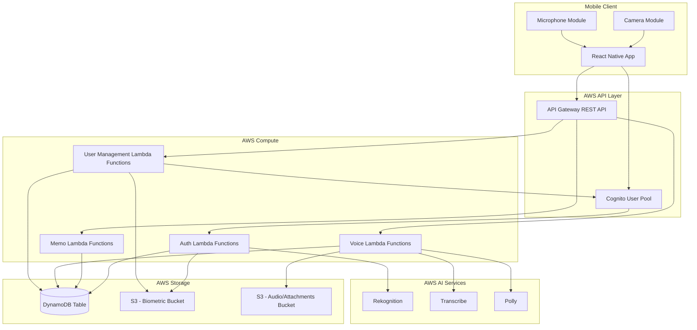
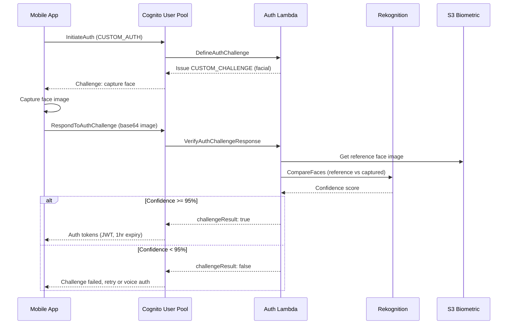
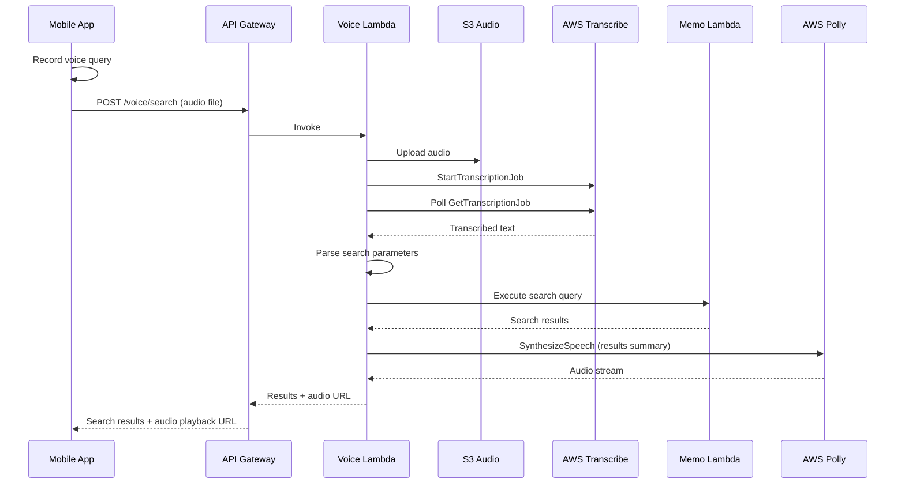
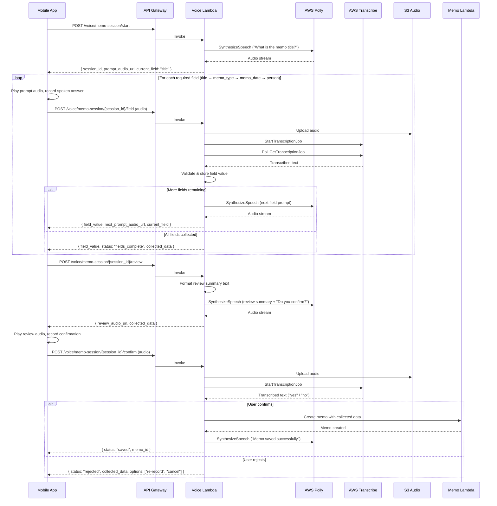

# Design Document: AI-Powered Government Memo Tracker

## Overview

This design describes the architecture for a mobile-first government memo tracking system with biometric authentication. The system enables government office personnel to register, search, and audit incoming/outgoing memos using a React Native app backed by a serverless Python/AWS stack.

Key design decisions:

- **Serverless-first**: All compute runs on AWS Lambda (Python 3.12) behind API Gateway, keeping costs within free tier.
- **Single-table DynamoDB design**: Memos, access logs, users, and voice notes share one DynamoDB table with composite keys, minimizing provisioned capacity usage and simplifying access patterns.
- **Biometric authentication via Cognito custom auth flow**: Facial recognition (Rekognition `CompareFaces`) and voice recognition are integrated as Cognito Lambda triggers, keeping auth centralized.
- **Batch transcription for voice input**: Audio is uploaded to S3 and processed via Transcribe batch jobs (not streaming), since Lambda functions have a 15-minute timeout and batch mode is simpler for short memo notes.
- **Voice biometrics via voiceprint embeddings**: Since AWS does not offer a standalone speaker verification API outside of Amazon Connect, voice recognition is implemented by storing voice feature embeddings extracted from enrollment samples and comparing them against authentication samples using a cosine similarity approach in a Lambda function.

## Architecture

### High-Level Architecture Diagram



### Authentication Flow



### Voice Search Flow



### Voice-Guided Memo Registration Flow

This flow describes the field-by-field voice-guided memo registration process. The mobile app orchestrates the conversation locally, calling the backend for each transcription and synthesis step. A session object on the client tracks which fields have been collected.



## Components and Interfaces

### 1. Auth Service (Lambda Functions)

Handles biometric authentication via Cognito custom auth flow.

| Function | Trigger | Description |
|---|---|---|
| `define_auth_challenge` | Cognito DefineAuthChallenge | Determines which challenge to issue (facial or voice) |
| `create_auth_challenge` | Cognito CreateAuthChallenge | Creates challenge metadata for the client |
| `verify_auth_challenge` | Cognito VerifyAuthChallengeResponse | Verifies biometric response against stored reference |

**Interface:**

```python
# verify_auth_challenge handler
def handler(event, context) -> dict:
    """
    event contains:
      - userName: str (Cognito username)
      - request.challengeAnswer: str (base64 image or audio reference)
      - request.privateChallengeParameters.authType: str ("facial" | "voice")
    returns:
      - response.answerCorrect: bool
    """
```

### 2. Memo Service (Lambda Functions)

Core CRUD operations for memo records and access logging.

| Endpoint | Method | Function | Description |
|---|---|---|---|
| `/memos` | POST | `create_memo` | Register a new memo |
| `/memos` | GET | `search_memos` | Search memos by title, date, type, person |
| `/memos/{id}` | GET | `get_memo` | Retrieve a single memo (creates access log) |
| `/memos/{id}/notes` | POST | `add_memo_note` | Add a text note to a memo |
| `/memos/{id}/access-log` | GET | `get_access_log` | Get access history (Superuser only) |

**Interface:**

```python
# create_memo handler
def handler(event, context) -> dict:
    """
    Request body:
      - title: str (required)
      - memo_type: str ("incoming" | "outgoing", required)
      - memo_date: str (ISO 8601 date, required)
      - person_brought_in: str (required if incoming)
      - person_took_out: str (required if outgoing)
    Returns:
      - 201: { memo_id, title, memo_type, memo_date, recorded_at, ... }
      - 400: { error, missing_fields[] }
    """

# search_memos handler
def handler(event, context) -> dict:
    """
    Query parameters:
      - title: str (partial match)
      - date_from: str (ISO 8601)
      - date_to: str (ISO 8601)
      - memo_type: str ("incoming" | "outgoing")
      - person_name: str (matches brought_in or took_out)
    Returns:
      - 200: { memos: [...], count: int }
    """
```

### 3. Voice Service (Lambda Functions)

Handles speech-to-text, text-to-speech, voice search parsing, and voice-guided memo registration.

| Endpoint | Method | Function | Description |
|---|---|---|---|
| `/voice/transcribe` | POST | `transcribe_audio` | Convert audio to text for memo notes |
| `/voice/search` | POST | `voice_search` | Transcribe + parse + search + synthesize |
| `/voice/synthesize` | POST | `synthesize_speech` | Convert text to audio via Polly |
| `/voice/memo-session/start` | POST | `start_memo_session` | Begin a voice-guided memo registration session |
| `/voice/memo-session/{session_id}/field` | POST | `submit_session_field` | Submit a spoken field response for the current prompt |
| `/voice/memo-session/{session_id}/review` | POST | `review_memo_session` | Generate a review summary audio of all collected fields |
| `/voice/memo-session/{session_id}/confirm` | POST | `confirm_memo_session` | Submit spoken confirmation or rejection to finalize or discard the memo |

**Interface:**

```python
# voice_search handler
def handler(event, context) -> dict:
    """
    Request body:
      - audio_key: str (S3 key of uploaded audio)
      - memo_id: str (optional, for adding notes)
    Returns:
      - 200: { transcribed_text, search_results[], audio_response_url }
      - 422: { error: "Could not parse search query", transcribed_text }
    """
```

**Voice-Guided Memo Registration Interfaces:**

```python
# start_memo_session handler
def handler(event, context) -> dict:
    """
    Starts a new voice-guided memo registration session.
    Generates the first field prompt audio via Polly.

    Request body:
      - user_id: str (authenticated user)
    Returns:
      - 201: {
          session_id: str,
          prompt_audio_url: str,  # S3 presigned URL for "What is the memo title?"
          current_field: str,     # "title"
          fields_remaining: list  # ["memo_type", "memo_date", "person"]
        }
    """

# submit_session_field handler
def handler(event, context) -> dict:
    """
    Transcribes the user's spoken response for the current field,
    validates it, stores it in the session, and returns the next prompt.

    Path params:
      - session_id: str
    Request body:
      - audio_key: str (S3 key of uploaded audio)
    Returns:
      - 200: {
          field_name: str,          # field that was just captured
          field_value: str,         # transcribed and validated value
          next_prompt_audio_url: str | None,  # None if all fields collected
          current_field: str | None,          # next field or None
          fields_remaining: list,
          status: str               # "in_progress" | "fields_complete"
        }
      - 422: {
          error: "Transcription failed",
          retry_count: int,         # current retry count for this field
          max_retries: 2,
          prompt_audio_url: str     # re-prompt audio URL
        }
    """

# review_memo_session handler
def handler(event, context) -> dict:
    """
    Generates a Polly audio summary of all collected fields for user review.

    Path params:
      - session_id: str
    Returns:
      - 200: {
          review_audio_url: str,    # Polly audio reading back all fields
          collected_data: {
            title: str,
            memo_type: str,
            memo_date: str,
            person_brought_in: str | None,
            person_took_out: str | None
          }
        }
      - 400: { error: "Session fields incomplete" }
    """

# confirm_memo_session handler
def handler(event, context) -> dict:
    """
    Transcribes the user's spoken confirmation ("yes"/"no").
    If confirmed, creates the memo. If rejected, returns options.

    Path params:
      - session_id: str
    Request body:
      - audio_key: str (S3 key of uploaded confirmation audio)
    Returns (confirmed):
      - 201: {
          status: "saved",
          memo_id: str,
          confirmation_audio_url: str  # "Memo saved successfully"
        }
    Returns (rejected):
      - 200: {
          status: "rejected",
          collected_data: { ... },
          options: ["re-record", "cancel"],
          prompt_audio_url: str  # "Which field would you like to re-record?"
        }
    Returns (unclear):
      - 422: {
          error: "Could not understand confirmation",
          prompt_audio_url: str  # "Please say yes or no"
        }
    """
```

**Voice Session Field Prompts:**

```python
FIELD_PROMPTS = {
    "title": "What is the memo title?",
    "memo_type": "Is this an incoming or outgoing memo?",
    "memo_date": "What is the date on the memo?",
    "person_brought_in": "Who brought in this memo?",
    "person_took_out": "Who took out this memo?",
}

REVIEW_TEMPLATE = (
    "Here is what I have recorded. "
    "Title: {title}. "
    "Type: {memo_type}. "
    "Date: {memo_date}. "
    "{person_field}: {person_name}. "
    "Would you like to save this memo? Please say yes or no."
)
```

**Voice Query Parser:**

```python
def parse_voice_query(transcribed_text: str) -> dict:
    """
    Extracts search parameters from natural language text.
    Uses keyword matching and date pattern recognition.

    Input: "Find memos from January 2024 about budget"
    Output: {
        "title": "budget",
        "date_from": "2024-01-01",
        "date_to": "2024-01-31"
    }

    Input: "Show outgoing memos by John Smith"
    Output: {
        "memo_type": "outgoing",
        "person_name": "John Smith"
    }
    """
```

### 4. User Management Service (Lambda Functions)

Superuser-only operations for account lifecycle.

| Endpoint | Method | Function | Description |
|---|---|---|---|
| `/users` | POST | `create_user` | Register new user account |
| `/users/{id}` | PUT | `update_user` | Modify user details |
| `/users/{id}/deactivate` | POST | `deactivate_user` | Deactivate account, revoke sessions |
| `/users/{id}/enroll-face` | POST | `enroll_face` | Store facial reference in Rekognition |
| `/users/{id}/enroll-voice` | POST | `enroll_voice` | Store voice reference sample |

**Interface:**

```python
# create_user handler
def handler(event, context) -> dict:
    """
    Request body:
      - full_name: str (required)
      - email: str (required, unique)
      - department: str (required)
      - role: str ("regular_user" | "superuser", required)
      - phone_number: str (required)
    Returns:
      - 201: { user_id, full_name, email, department, role, created_at }
      - 400: { error, invalid_fields[] }
      - 409: { error: "Email already registered" }
    """
```

### 5. Mobile App (React Native)

| Screen | Description |
|---|---|
| LoginScreen | Biometric auth (camera/mic capture) |
| DashboardScreen | Quick actions: register memo, search, voice input |
| MemoFormScreen | Form for registering incoming/outgoing memos |
| VoiceMemoRegistrationScreen | Voice-guided memo registration with field-by-field prompts and review |
| MemoDetailScreen | View memo details, notes, trigger access log |
| SearchScreen | Text and voice search with filters |
| UserManagementScreen | Superuser: create/edit/deactivate users |
| UserRegistrationForm | Structured form with validation |
| BiometricEnrollmentScreen | Capture face image and voice sample |

## Data Models

### DynamoDB Single-Table Design

The system uses a single DynamoDB table (`MemoTrackerTable`) with a composite primary key (`PK`, `SK`) and two Global Secondary Indexes (GSIs) to support all access patterns.

**Table Structure:**

| Entity | PK | SK | GSI1PK | GSI1SK | GSI2PK | GSI2SK |
|---|---|---|---|---|---|---|
| Memo | `MEMO#{memo_id}` | `METADATA` | `TYPE#{memo_type}` | `DATE#{memo_date}` | `PERSON#{person_name}` | `DATE#{memo_date}` |
| Access Log | `MEMO#{memo_id}` | `LOG#{timestamp}#{user_id}` | — | — | — | — |
| Memo Note | `MEMO#{memo_id}` | `NOTE#{timestamp}` | — | — | — | — |
| User | `USER#{user_id}` | `PROFILE` | `EMAIL#{email}` | `PROFILE` | `ROLE#{role}` | `USER#{user_id}` |
| User Audit | `USER#{user_id}` | `AUDIT#{timestamp}` | — | — | — | — |
| Auth Attempt | `USER#{user_id}` | `AUTH#{timestamp}` | — | — | — | — |
| Voice Session | `VSESSION#{session_id}` | `METADATA` | — | — | — | — |

**GSI Definitions:**

- **GSI1** (`GSI1PK`, `GSI1SK`): Supports queries by memo type + date range, and user lookup by email.
- **GSI2** (`GSI2PK`, `GSI2SK`): Supports queries by person name + date range, and user lookup by role.

### Entity Schemas

**Memo:**

```python
{
    "PK": "MEMO#<uuid>",
    "SK": "METADATA",
    "memo_id": "<uuid>",
    "title": "Budget Allocation Q3",
    "memo_type": "incoming",          # "incoming" | "outgoing"
    "memo_date": "2024-03-15",        # date on the memo
    "recorded_at": "2024-03-15T10:30:00Z",  # auto-set UTC
    "person_brought_in": "Jane Doe",  # required if incoming
    "person_took_out": None,          # required if outgoing
    "created_by": "<user_id>",
    "GSI1PK": "TYPE#incoming",
    "GSI1SK": "DATE#2024-03-15",
    "GSI2PK": "PERSON#jane doe",      # lowercased for search
    "GSI2SK": "DATE#2024-03-15",
    "entity_type": "MEMO"
}
```

**Access Log Entry:**

```python
{
    "PK": "MEMO#<memo_id>",
    "SK": "LOG#2024-03-15T10:35:00Z#<user_id>",
    "memo_id": "<memo_id>",
    "user_id": "<user_id>",
    "user_name": "John Smith",
    "action": "VIEW",                 # VIEW | SEARCH_RESULT
    "timestamp": "2024-03-15T10:35:00Z",
    "entity_type": "ACCESS_LOG"
}
```

**Memo Note:**

```python
{
    "PK": "MEMO#<memo_id>",
    "SK": "NOTE#2024-03-15T11:00:00Z",
    "memo_id": "<memo_id>",
    "note_text": "Discussed with department head...",
    "created_by": "<user_id>",
    "created_at": "2024-03-15T11:00:00Z",
    "source": "voice",                # "voice" | "text"
    "entity_type": "MEMO_NOTE"
}
```

**User:**

```python
{
    "PK": "USER#<user_id>",
    "SK": "PROFILE",
    "user_id": "<user_id>",
    "full_name": "John Smith",
    "email": "john.smith@gov.example",
    "department": "Finance",
    "role": "regular_user",           # "regular_user" | "superuser"
    "phone_number": "+1234567890",
    "status": "active",               # "active" | "deactivated"
    "face_image_s3_key": "biometric/<user_id>/face.jpg",
    "voice_sample_s3_key": "biometric/<user_id>/voice.wav",
    "cognito_sub": "<cognito_sub>",
    "created_at": "2024-01-10T08:00:00Z",
    "failed_auth_attempts": 0,
    "GSI1PK": "EMAIL#john.smith@gov.example",
    "GSI1SK": "PROFILE",
    "GSI2PK": "ROLE#regular_user",
    "GSI2SK": "USER#<user_id>",
    "entity_type": "USER"
}
```

**Voice Session:**

```python
{
    "PK": "VSESSION#<session_id>",
    "SK": "METADATA",
    "session_id": "<session_id>",
    "user_id": "<user_id>",
    "status": "in_progress",          # "in_progress" | "fields_complete" | "saved" | "cancelled"
    "current_field": "memo_type",     # next field to prompt for
    "fields_collected": {
        "title": "Budget Allocation Q3",
        "memo_type": None,
        "memo_date": None,
        "person_brought_in": None,
        "person_took_out": None
    },
    "field_order": ["title", "memo_type", "memo_date", "person"],
    "retry_counts": {                 # per-field retry tracking
        "title": 0,
        "memo_type": 0,
        "memo_date": 0,
        "person": 0
    },
    "created_at": "2024-03-15T10:30:00Z",
    "updated_at": "2024-03-15T10:31:00Z",
    "ttl": 1710500400,               # auto-expire after 1 hour (epoch seconds)
    "entity_type": "VOICE_SESSION"
}
```

### S3 Bucket Structure

**Biometric Bucket** (`memo-tracker-biometric-{env}`):
```
biometric/
  {user_id}/
    face.jpg              # Reference facial image
    voice_enrollment.wav  # Reference voice sample
```

**Audio/Attachments Bucket** (`memo-tracker-audio-{env}`):
```
audio/
  transcribe/
    {job_id}/input.wav    # Audio uploaded for transcription
    {job_id}/output.json  # Transcribe result
  polly/
    {request_id}.mp3      # Synthesized speech output
  voice-sessions/
    {session_id}/
      {field_name}.wav    # Audio response for each field
      confirmation.wav    # Confirmation audio
```

### Access Patterns Summary

| Access Pattern | Key Condition | Index |
|---|---|---|
| Get memo by ID | PK = `MEMO#{id}`, SK = `METADATA` | Table |
| Get access logs for memo | PK = `MEMO#{id}`, SK begins_with `LOG#` | Table |
| Get notes for memo | PK = `MEMO#{id}`, SK begins_with `NOTE#` | Table |
| Search by memo type + date | GSI1PK = `TYPE#{type}`, GSI1SK between dates | GSI1 |
| Search by person + date | GSI2PK = `PERSON#{name}`, GSI2SK between dates | GSI2 |
| Search by title | Scan with filter on `title` contains | Table (scan) |
| Get user by ID | PK = `USER#{id}`, SK = `PROFILE` | Table |
| Get user by email | GSI1PK = `EMAIL#{email}`, GSI1SK = `PROFILE` | GSI1 |
| List users by role | GSI2PK = `ROLE#{role}` | GSI2 |
| Get user audit trail | PK = `USER#{id}`, SK begins_with `AUDIT#` | Table |
| Get voice session | PK = `VSESSION#{session_id}`, SK = `METADATA` | Table |


## Correctness Properties

*A property is a characteristic or behavior that should hold true across all valid executions of a system — essentially, a formal statement about what the system should do. Properties serve as the bridge between human-readable specifications and machine-verifiable correctness guarantees.*

### Property 1: Memo creation round-trip

*For any* valid memo input (with title, memo_type, memo_date, and the appropriate person field), creating the memo and then retrieving it by ID should return a record containing all original fields unchanged, a unique memo_id, and a recorded_at timestamp that is a valid UTC ISO 8601 value.

**Validates: Requirements 1.1, 1.2, 1.5, 2.5**

### Property 2: Memo conditional field validation

*For any* memo registration request, if the memo_type is "incoming" and person_brought_in is missing, or if the memo_type is "outgoing" and person_took_out is missing, or if any universally required field (title, memo_type, memo_date) is missing, the system should reject the request with an error message that identifies the specific missing field(s).

**Validates: Requirements 1.3, 1.4, 1.6**

### Property 3: Title search completeness and precision

*For any* set of stored memos and any non-empty search string, searching by title should return exactly the memos whose titles contain the search string (case-insensitive) — no matching memo should be omitted and no non-matching memo should be included.

**Validates: Requirements 2.1**

### Property 4: Date range search correctness

*For any* set of stored memos and any date range [start, end], searching by date range should return exactly the memos whose memo_date falls within the range (inclusive) — no memo within the range should be omitted and no memo outside the range should be included.

**Validates: Requirements 2.2**

### Property 5: Memo type filter correctness

*For any* set of stored memos and a chosen memo_type ("incoming" or "outgoing"), searching by type should return exactly the memos matching that type.

**Validates: Requirements 2.3**

### Property 6: Person name search correctness

*For any* set of stored memos and a person name, searching by person name should return exactly the memos where that person appears as either person_brought_in or person_took_out.

**Validates: Requirements 2.4**

### Property 7: Access log creation invariant

*For any* memo view operation by any authenticated user, an access log entry should be created containing the correct user_id, memo_id, a valid timestamp, and the action performed.

**Validates: Requirements 3.1**

### Property 8: Access log descending sort order

*For any* memo with multiple access log entries, retrieving the access history should return entries sorted by timestamp in strictly descending order.

**Validates: Requirements 3.2**

### Property 9: Access log immutability

*For any* existing access log entry, any attempt to modify or delete it should be rejected, and the original entry should remain unchanged.

**Validates: Requirements 3.4**

### Property 10: Memo note field completeness

*For any* note added to a memo (whether from voice transcription or text input), the stored note should contain the note_text, the creating user's identity, and a valid creation timestamp.

**Validates: Requirements 4.3**

### Property 11: Voice query parse round-trip

*For any* combination of valid search parameters (title keyword, date range, memo type, person name), formatting them into a natural language query string and then parsing that string should extract parameters equivalent to the originals.

**Validates: Requirements 5.2**

### Property 12: Facial auth confidence threshold

*For any* confidence score returned by the face comparison service, authentication should succeed if and only if the score is greater than or equal to 95.0%.

**Validates: Requirements 6.2, 6.3**

### Property 13: Account lockout after repeated failures

*For any* user account, if facial recognition fails 3 times and voice recognition fails 3 times consecutively, the account should be locked and the superuser should be notified.

**Validates: Requirements 7.5**

### Property 14: Superuser-only authorization

*For any* user management operation (create, modify, deactivate user) and any user without the superuser role, the operation should be denied with an authorization error.

**Validates: Requirements 8.1, 8.6**

### Property 15: User creation round-trip

*For any* valid user registration data (full_name, email, department, role, phone_number) submitted by a superuser, creating the user and then retrieving by ID should return a record with all original fields preserved.

**Validates: Requirements 8.2**

### Property 16: User deactivation revokes access

*For any* active user account, deactivating it should set the status to "deactivated" and invalidate all active sessions, preventing any further authenticated operations.

**Validates: Requirements 8.5**

### Property 17: User modification audit trail

*For any* user account modification performed by a superuser, an audit log entry should be created containing the superuser's identity and a valid timestamp.

**Validates: Requirements 8.7**

### Property 18: Registration form validation

*For any* user registration form submission, if any required field (full_name, email, department, role, phone_number) is missing or if the email does not match a valid email format, validation should reject the submission.

**Validates: Requirements 9.2**

### Property 19: Duplicate email prevention

*For any* email address that is already associated with an existing user account, attempting to register a new user with that same email should be rejected.

**Validates: Requirements 9.5**

### Property 20: Offline operation queuing round-trip

*For any* set of operations submitted while the device is offline, all operations should be queued and then successfully submitted in order when network connectivity is restored.

**Validates: Requirements 11.3**

### Property 21: Token expiry invariant

*For any* authentication token issued by the system, the token's expiry time should be at most 1 hour from the time of issuance.

**Validates: Requirements 12.3**

### Property 22: Voice session field prompt ordering

*For any* voice memo registration session and any memo type (incoming or outgoing), the system should prompt for fields in the correct order (title → memo_type → memo_date → person), and the person field prompt should be "Who brought in this memo?" when memo_type is "incoming" or "Who took out this memo?" when memo_type is "outgoing".

**Validates: Requirements 4.6**

### Property 23: Voice session retry logic

*For any* voice session field and any retry count, if transcription fails and the retry count is less than 2, the system should re-prompt for the same field. If the retry count reaches 2, the system should offer the user the option to cancel or switch to manual text input.

**Validates: Requirements 4.8**

### Property 24: Voice session review completeness

*For any* complete set of voice-collected memo fields (title, memo_type, memo_date, and the appropriate person field), the generated review summary text should contain every collected field value.

**Validates: Requirements 4.9**

### Property 25: Voice session confirmation round-trip

*For any* valid set of voice-collected memo fields, confirming the session should create a memo record that, when retrieved by ID, contains all the original field values unchanged.

**Validates: Requirements 4.10**

## Error Handling

### API Error Response Format

All Lambda functions return errors in a consistent JSON format:

```json
{
    "error": "Human-readable error message",
    "error_code": "MEMO_VALIDATION_ERROR",
    "details": {
        "missing_fields": ["person_brought_in"]
    }
}
```

### Error Categories

| Error Code | HTTP Status | Description |
|---|---|---|
| `VALIDATION_ERROR` | 400 | Missing or invalid request fields |
| `AUTH_FAILED` | 401 | Biometric verification failed |
| `TOKEN_EXPIRED` | 401 | Authentication token has expired |
| `FORBIDDEN` | 403 | User lacks required role (e.g., non-superuser) |
| `NOT_FOUND` | 404 | Memo or user not found |
| `DUPLICATE_EMAIL` | 409 | Email already registered |
| `ACCOUNT_LOCKED` | 423 | Account locked after repeated auth failures |
| `TRANSCRIPTION_FAILED` | 422 | AWS Transcribe could not process audio |
| `QUERY_PARSE_FAILED` | 422 | Voice query could not be parsed into search params |
| `SESSION_NOT_FOUND` | 404 | Voice memo session not found or expired |
| `SESSION_INCOMPLETE` | 400 | Voice session fields not yet fully collected |
| `CONFIRMATION_UNCLEAR` | 422 | Could not understand yes/no confirmation response |
| `FIELD_RETRY_EXCEEDED` | 422 | Maximum retries exceeded for a voice session field |
| `SERVICE_UNAVAILABLE` | 503 | AWS service dependency unavailable |

### Retry and Fallback Strategies

- **Biometric auth failure**: User gets 3 attempts per method. After facial recognition fails, system offers voice recognition fallback. After both fail 3 times each, account is locked.
- **Transcription failure**: User is shown an error and can retry. Audio is retained in S3 for debugging.
- **Voice query parse failure**: User is prompted to rephrase. The raw transcription is shown so the user can manually search.
- **Voice session field failure**: If transcription fails for a field, the system re-prompts with the same question (up to 2 retries). After 2 retries, the user is offered the option to cancel or switch to manual text input for that field.
- **Voice session expiry**: Voice sessions have a 1-hour TTL in DynamoDB. Expired sessions return a `SESSION_NOT_FOUND` error, and the user must start a new session.
- **Network errors (mobile)**: Operations are queued locally using AsyncStorage. A background sync process submits queued operations when connectivity returns, in FIFO order.
- **DynamoDB throttling**: Lambda functions use exponential backoff with jitter (boto3 built-in retry). API Gateway returns 503 if retries are exhausted.
- **Token expiry**: Mobile app intercepts 401 responses and redirects to biometric re-authentication before retrying the original request.

### Access Log Error Handling

Access log writes use DynamoDB conditional expressions to enforce append-only behavior. Any `UpdateItem` or `DeleteItem` on access log entries is rejected at the application layer — the Lambda functions do not expose endpoints for these operations. The DynamoDB table uses IAM policies that restrict the Lambda execution role to `PutItem` only for access log SK patterns.

## Testing Strategy

### Property-Based Testing

This feature includes significant pure business logic suitable for property-based testing. The Python backend will use **Hypothesis** as the PBT library.

**Configuration:**
- Minimum 100 examples per property test (`@settings(max_examples=100)`)
- Each test is tagged with a comment referencing its design property
- Tag format: `# Feature: ai-memo-tracker, Property {N}: {title}`

**Properties to implement as PBT:**

| Property | Test Target | Generator Strategy |
|---|---|---|
| 1: Memo creation round-trip | `create_memo` + `get_memo` | Random strings for title, random dates, random person names, random choice of incoming/outgoing |
| 2: Memo conditional field validation | `create_memo` validation | Random memo inputs with randomly removed required fields |
| 3: Title search completeness | `search_memos(title=...)` | Random memo sets + random substring queries |
| 4: Date range search | `search_memos(date_from, date_to)` | Random memo sets + random date ranges |
| 5: Type filter search | `search_memos(memo_type=...)` | Random memo sets + random type choice |
| 6: Person name search | `search_memos(person_name=...)` | Random memo sets + random person names |
| 7: Access log creation | `get_memo` side effect | Random user/memo combinations |
| 8: Access log sort order | `get_access_log` | Random access log entries with random timestamps |
| 9: Access log immutability | Access log modification attempts | Random existing log entries + random modifications |
| 10: Note field completeness | `add_memo_note` | Random note text, random users |
| 11: Voice query parse round-trip | `parse_voice_query` | Random search parameter combinations formatted as natural language |
| 12: Facial auth threshold | `verify_auth_challenge` | Random float confidence scores in [0, 100] |
| 14: Superuser authorization | User management endpoints | Random users with random non-superuser roles |
| 15: User creation round-trip | `create_user` + `get_user` | Random valid user data |
| 18: Form validation | Registration form validator | Random form inputs with randomly invalid fields |
| 19: Duplicate email | `create_user` twice | Random email addresses |
| 22: Voice session field prompt ordering | `start_memo_session` + `submit_session_field` | Random memo types (incoming/outgoing), random session states with varying fields collected |
| 23: Voice session retry logic | `submit_session_field` error handling | Random fields + random retry counts (0–3), mock Transcribe failures |
| 24: Voice session review completeness | `review_memo_session` | Random complete field sets (random titles, types, dates, person names) |
| 25: Voice session confirmation round-trip | `confirm_memo_session` + `get_memo` | Random valid field sets, mock Transcribe for "yes" confirmation |

### Unit Testing (Example-Based)

Unit tests cover specific examples, edge cases, and integration points:

- **Auth flow**: Cognito custom auth challenge lifecycle (define → create → verify)
- **Voice fallback**: Camera unavailable triggers voice auth (Req 6.5)
- **Transcription attachment**: Mock Transcribe response attached to correct memo (Req 4.2)
- **Biometric enrollment prompts**: User creation triggers face + voice enrollment (Req 8.3, 8.4)
- **Permission handling**: Camera/mic permission denial shows explanatory message (Req 11.5)
- **Token expiry**: Expired token triggers re-authentication flow (Req 12.4)
- **Form UI**: Registration form renders all required fields (Req 9.1)
- **Validation UI**: Invalid form highlights specific fields with error messages (Req 9.3)
- **Voice session rejection flow**: User says "no" during confirmation, system returns collected data with re-record/cancel options (Req 4.11)
- **Voice session expiry**: Accessing an expired session returns SESSION_NOT_FOUND error
- **Voice session field transcription**: Mock Transcribe response is correctly stored in session state for each field (Req 4.7)

### Integration Testing

Integration tests verify AWS service interactions with real (or LocalStack) services:

- **Rekognition**: IndexFaces during enrollment, CompareFaces during auth
- **Transcribe**: Batch transcription job lifecycle (start → poll → complete)
- **Polly**: SynthesizeSpeech returns valid audio
- **Polly voice prompts**: SynthesizeSpeech generates correct audio for each field prompt and review summary
- **DynamoDB**: CRUD operations, GSI queries, conditional writes
- **DynamoDB voice sessions**: Voice session create, update fields, TTL expiry
- **S3**: Biometric upload/retrieval, audio file lifecycle
- **S3 voice session audio**: Field response audio storage and retrieval under voice-sessions/ prefix
- **Cognito**: User pool operations, custom auth flow end-to-end
- **API Gateway**: Endpoint routing, authorization headers, CORS
- **Voice-guided registration end-to-end**: Full session lifecycle (start → field submissions → review → confirm → memo created)

### Smoke Testing

Smoke tests verify infrastructure configuration:

- DynamoDB table exists with correct key schema and GSIs
- S3 buckets exist with encryption enabled and correct access policies
- Biometric and audio buckets are separate
- API Gateway enforces HTTPS
- Lambda functions have correct IAM roles
- Cognito user pool has custom auth flow enabled
- All services are within free-tier configuration limits

### Test Environment

- **Backend unit/property tests**: pytest + Hypothesis, moto (AWS mocking library) for DynamoDB/S3/Cognito
- **Backend integration tests**: LocalStack or AWS dev account
- **Mobile unit tests**: Jest + React Native Testing Library
- **Mobile integration tests**: Detox for end-to-end mobile testing
